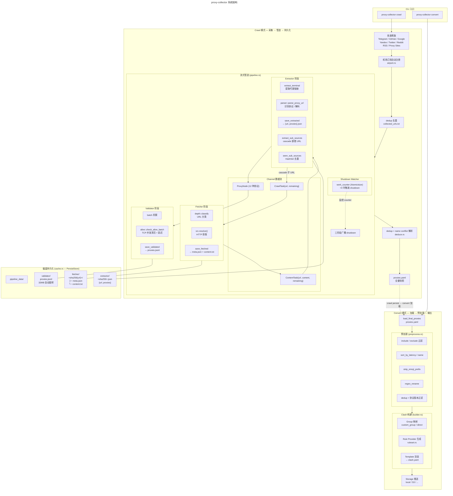

# proxy-collector 系统架构

## 核心数据路径

| 阶段 | 输入 | 输出 | 持久化 |
|------|------|------|--------|
| **Fetcher** | `CrawlTask{url, remaining}` | `ContentTask{url, content, remaining}` | `<sha256>/meta.json` + `content.txt` |
| **Extractor** | `ContentTask` | `ProxyNode` (12 种协议) | `<sha256>.json` → `{"url","proxies"}` |
| **Validator** | `ProxyNode` | `EnrichedProxy{alive, latency, ...}` | `proxies.jsonl` (32 MiB 旋转) |

## 关键设计点

- **管道是写通（write-through sink）** — 持久化是纯副作用，不阻塞 channel 数据流
- **work_counter 仅 extractor 递减** — fetcher 是中转不参与计数；resolve 失败时 spawned task 即时递减防止泄漏
- **Cascade 去重** — `seen_sub_sources: HashSet<String>` 防止相同子 URL 被重复抓取
- **中间数据自动清理** — 每次 `PersistStore::new()` 清除 `fetcher/` `extractor/`，保留 `proxies.jsonl` 和 `proxies.yaml`
- **双模式分工** — `crawl` 负责采集 + 管道处理 + 持久化；`convert` 负责加载 + 预处理 + Clash 构建 + 存储推送
